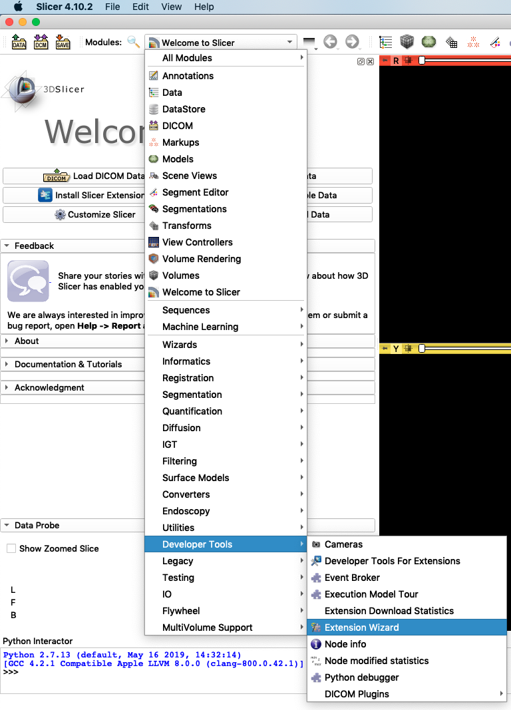
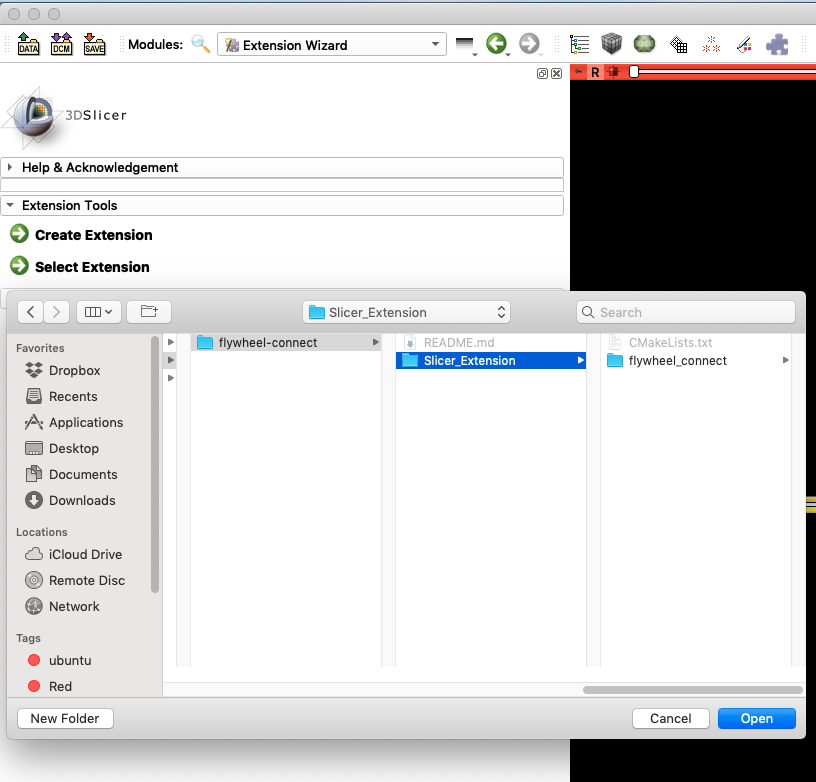

# flywheel-connect
A 3D Slicer Extension to view, select, and download nifti (nii.gz) data from the flywheel heirarchy in the interactive environment of [3D Slicer](https://www.slicer.org/).

## Development Notes
flywheel-connect is built in the [3D Slicer Extension Framework](https://www.slicer.org/wiki/Documentation/Nightly/Developers/Tutorials/Extension) leveraging the [flywheel python SDK](https://flywheel-io.github.io/core/branches/master/python/). It currently allows an authenticated user to browse through a simple container hierarchy (Groups->Projects->Sessions->Acquisitions) and retrieve nifti files from a selected acquisition to display in 3D Slicer. Future iterations of this extension are intended to 
1. Access files, information, and analyses at all levels of the Project->...->Acquisition hierarchy.
2. Allow uploading of a 3D Slicer "Medical Record Bundle" (.mrb zipped file) to a flywheel instance as an analysis object.
3. Download a Medical Record Bundle from flywheel and reinstantiate in 3D Slicer with all dependencies.

For developing with 3D Slicer, these 3D Slicer extensions (available through the "Extensions Manager") are highly recommended:

* [DeveloperToolsForExtensions](https://www.slicer.org/w/index.php/Documentation/Nightly/Extensions/DeveloperToolsForExtensions)
* [DebuggingTools](https://www.slicer.org/w/index.php/Documentation/Nightly/Extensions/DebuggingTools)

Furthermore, the [3D Slicer discourse community](https://discourse.slicer.org/) has been an invaluable resource.

## Installation Instructions
1. Clone this github repository into a convenient location
2. Use the 3D Slicer Modules->Developer Tools->Extension Wizard
   
3. Select Extension in the "Extension Tools" pane.
4. Navigate to the flywheel-connect/Slicer_Extension directory of the github repository and "Open".
	

## Usage Instructions
1. Navigate to flywheel-connect under the Modules drop-down box.
	
2. To access the flywheel container hierarchy first enter your [flywheel api-key](https://docs.flywheel.io/hc/en-us/articles/360015135654-User-Profile) and press "connect".
3. Navigate to the desired Acquisition in the hierarchy and press "Retrieve Acquisition". All compressed nifti files (.nii.gz) of that acquisition will be loaded into 3D Slicer.

## File Management
Files will be cached to the flywheelIO/ directory of the users home directory.  This is default and can be changed. If caching files is not desired, uncheck "Cache Images".  This will delete all files in the cache between downloads.
