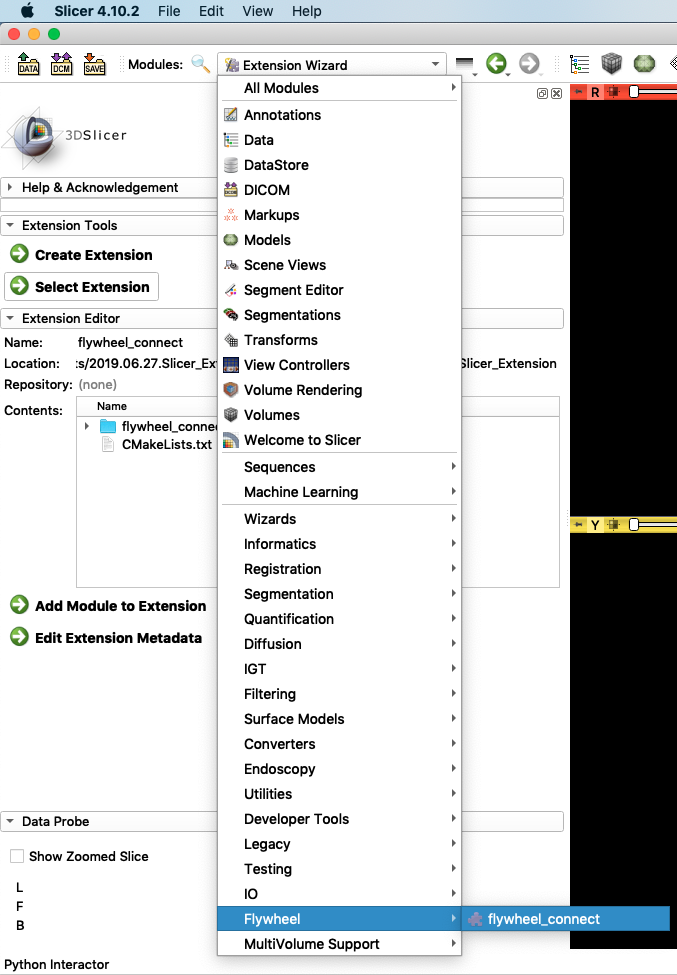
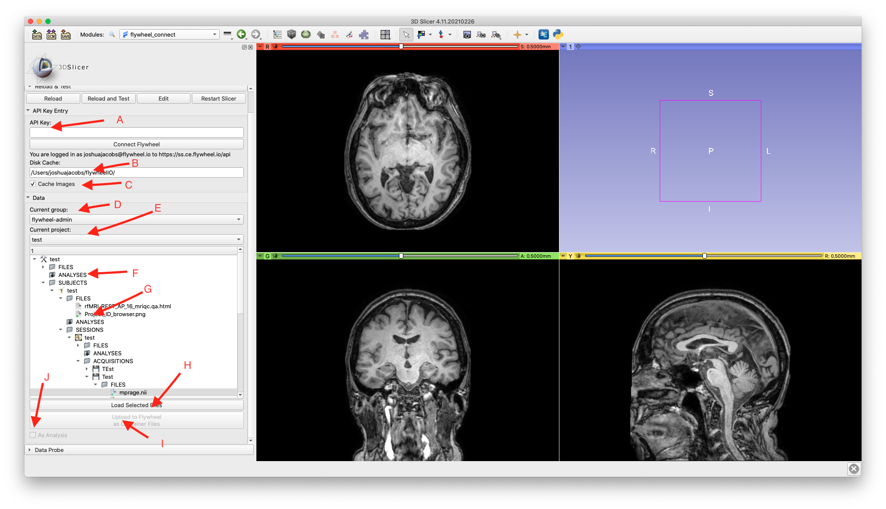

# flywheel-connect

A 3D Slicer Extension to view, select, and download images from a Flywheel instance to 
[3D Slicer](https://www.slicer.org/) and storing Slicer outputs back to Flywheel.

Flywheel is a comprehensive data management solutions for life sciences and imaging research.
More details at [https://flywheel.io/](https://flywheel.io/).

The Flywheel Connect 3D Slicer Extension is now in the [3D Slicer Extension Catalog](https://slicer.kitware.com/midas3/slicerappstore/extension/view?extensionId=460488) and available through the [3D Slicer Extensions Manager](https://slicer.readthedocs.io/en/latest/user_guide/extensions_manager.html) for direct installation.

## Usage Instructions

1. Install 3D Slicer and the Flywheel extension as described [here](INSTALLATION.md).
2. Navigate to flywheel-connect under the Modules drop-down box.
    
3. To access the Flywheel container hierarchy first enter your [Flywheel api-key](https://docs.flywheel.io/hc/en-us/articles/360015135654-User-Profile) and press "connect". If you have logged in with the Flywheel CLI (Command-Line-Interface), the cached Flywheel api-key can be used without entering a new one.
4. Navigate to the desired Acquisition in the Container Hierarchy Tree for a particular project.
5. By clicking on a file or files in the "Files" of a container, they can be loaded into 3D Slicer if they are images or models of the [3D Slicer Supported Data Formats](https://www.slicer.org/wiki/Documentation/4.8/SlicerApplication/SupportedDataFormat).  Compressed archives of DICOMs are also supported, if they are labeled as such in Flywheel.
6. By clicking on a container, slicer-derived files can be uploaded to Flywheel as

    * Files under a selected container
    * Files for a new Analysis object under a selected container.

## File Management
Files will be cached to the flywheelIO/ directory of the users home directory.  This is default and can be changed. If caching files is not desired, uncheck "Cache Images".  This will delete all files in the cache between downloads.

## Interface Overview
The interface is shown below. Notable areas are commented on:

* A) The API-Key can be entered here. Or the cached API-Key will be used from a previous `fw login {API-KEY}` command. When connecting to a Flywheel instance all data will be cleared from 3D Slicer to prevent invalid data references between Flywheel instances. If there is no previously cached login--or the supplied API-Key is invalid--an error dialog is displayed.
* B) Default disk cache.
* C) If unchecked, the cache will be cleared between downloads.
* D) Select Box for Groups. This will "cascade" selections for the first project, if it exists.
* E) Select Box for Projects. The selected project will clear and repopulate the tree. If no project exists, the tree is not enabled.
* F) Analyses objects are not automatically cached. Double-clicking will load all Analysis.
* G) Files that are cached will have a green "badge". Right-clicking on selected files will enable them to be cached. Some downloads are large.
* H) Load all selected files. Files that are Slicer-supported data formats (Images and Models) will be loaded. This will only be enabled if files are selected.
* I) Upload derived files to Flywheel Analysis or Container files. This will only be enabled if a single valid Flywheel Container is selected.
* H) If checked, indicates that derived files should be uploaded to Flywheel as Analysis output under the selected Container.
